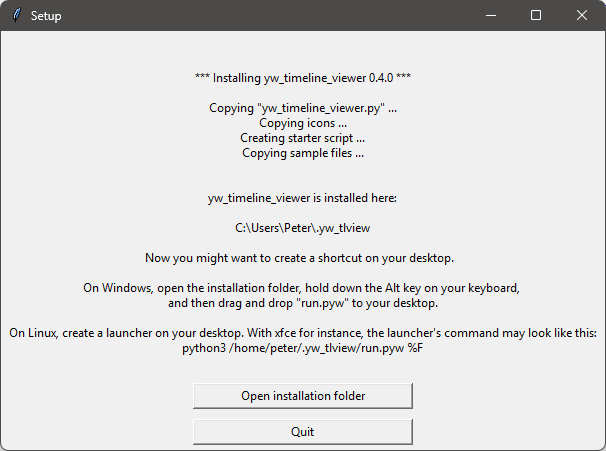

[Home](..) > [yw Timeline viewer Hilfe](index.md) > Vorbereitungen

---

# Vorbereitungen

## Das Programm einrichten

Die eigentliche Installation des Timeline viewers ist einfach und überschaubar.
Das Installationsprogramm erstellt automatisch ein Installationsverzeichnis,
kopiert alles Notwendige hinein und erzeugt eine für den jeweiligen Rechner angepasste 
Startdatei namens **run.pyw**, die aufgerufen werden muss, um die Anwendung zu starten.

Die notwendige Handarbeit besteht darin, diese Startdatei mit dem Desktop zu verknüpfen und, 
falls gewünscht, der Verknüpfung ein Programmsymbol zuzuweisen.

Dazu können Sie das Installationsverzeichnis über eine Schaltfläche im Nachrichtenfenster 
des Setup-Skripts öffnen.

---

**Hinweis**

- Unter Windows ist das Installationsverzeichnis `.yw_tlview` in Ihrem Benutzerprofil, 
  z.B. `C:\Users\username\.yw_tlview`.
- Unter Linux ist das Installationsverzeichnis `~/.yw_tlview`.

--- 

### Eine Desktop-Verknüpfung erstellen

- Unter Windows können Sie das **run.pyw**-Symbol mit gedrückter „Alt“-Taste 
  auf den Windows-Desktop ziehen und ablegen.
  
  
- Optional können Sie die Eigenschaften der Verknüpfung mit der rechten Maustaste öffnen, 
  und das Symbol ändern. 
  Dazu können Sie die Datei **tlv64.ico** im Ordner **icons** im Installationsverzeichnis 
  auswählen. 
- Dann können Sie die Verknüpfung umbenennen.

  

- Unter Linux möchten Sie vielleicht einen Programmstarter erstellen. 
  Lesen Sie dazu bitte die Dokumentation Ihres Desktops.   
    
  Mit dem XFCE-Desktop lautet mein Startbefehl zum Beispiel:
 
  ``python3 /home/peter/.yw_tlview/run.pyw %F``

